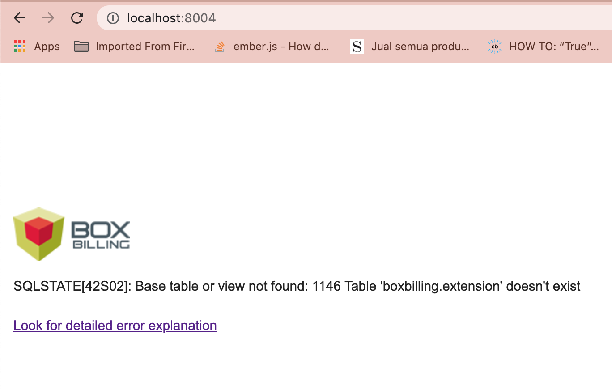
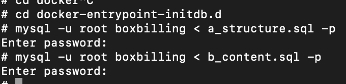
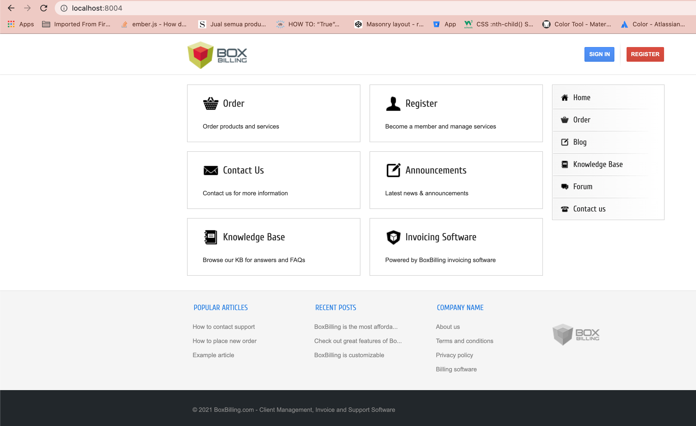

# BillingBox + Landing Page + Alpine 3.12 + Php 7.4 + nginx + MySQL

## How to run
``` bash
docker-compose up
```

### BoxBilling info


* in case you meet err like this 
  <div align="center">
    
  </div>

  it means `./database/a_structure.sql` and `./database/b_content.sql` are failed executed on mysql docker-entrypoint-initdb.d.

  so we can do execute sql file manually via `docker-exec` with command
    
    - ```bash 
        docker exec -it {container_name} 
        ``` 
        in case you want to know my container name this is my container name `niagahoster-test-2_db_1`
    - if you successfully login via docker exec run command bellow
    
        <div align="center">
            
        </div>

        first we change dir to docker-entrypoint-initdb.d, then we execute *.sql file that contain in ./sql/a_structure.sql and sql/b_content.sql.
        
        `password and username of this mysql container is root`

        here the full command

        ```bash
        cd docker-entrypoint-initdb.d && mysql -uroot -proot boxbilling < a_structure.sql && mysql -uroot -proot boxbilling < b_content.sql
        ```
    - if command above it successfully executed, try reload localhost:8004 below pict was successfully boxbilling on docker installation
        <div align="center">
            
        </div>

### Landing Page Info

* in case you also meet err like this
    <div align="center">
        
    </div>
    
  we can do execute sql file manually via `docker-exec` with command
    
    - ```bash 
        docker exec -it {container_name} 
        ``` 
        in case you want to know my container name this is my container name `niagahoster-test-2_db_landing_page_1`

        then run

        ```bash
        cd docker-entrypoint-initdb.d && mysql -uroot -proot niagahoster-test < database-dump.sql
        ```

        if command above it successfully executed, try reload localhost:8080 below pict was successfully landing-page installation 

        <div align="center">
            
        </div>